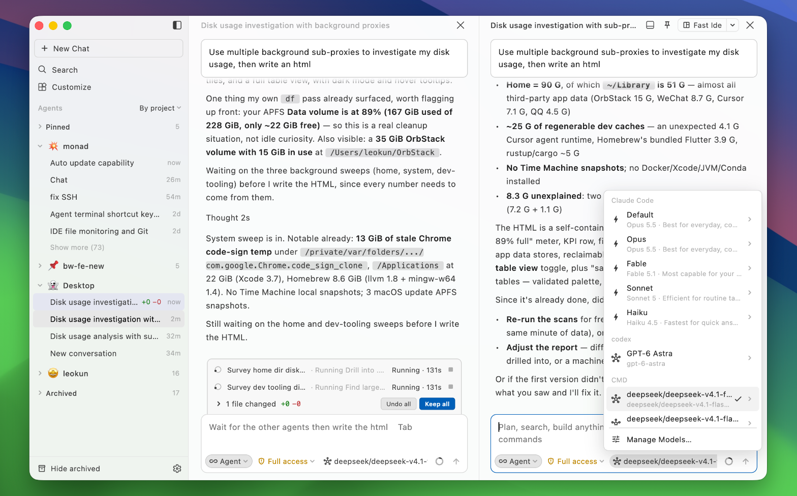

# BaoCode

[English](README.md) · [简体中文](README_CN.md) · [日本語](README_JA.md) · [Français](README_FR.md) · **Español**

Una interfaz de escritorio fácil de usar para [Claude Code](https://github.com/anthropics/claude-code), con un IDE integrado que responde en milisegundos.

[Sitio web](https://baocode.dev) · [Descargar](https://baocode.dev/download) · [Historial de cambios](https://baocode.dev/changelog)



> Presentación en español del README en inglés. Si hay diferencias, consulta [English](README.md). Los sitios y documentos enlazados no necesariamente están traducidos al español.

## Por qué BaoCode

Usamos Claude Code todos los días. El terminal es un buen lugar para ejecutarlo, pero no para leer sus resultados: los diffs largos desaparecen de la pantalla, cuesta volver a encontrar los pasos anteriores y revisar los cambios exige cambiar de aplicación. BaoCode es la ventana que queríamos para trabajar con él.

BaoCode no tiene un agente propio, por diseño. Claude Code es el agente, con su ecosistema de herramientas, skills, plugins, servidores MCP, subagentes y hooks. BaoCode ofrece una interfaz legible y hace que las funciones complementarias estén listas para usar. Ejecuta el Claude Code que ya tienes instalado, con tu configuración y tu `CLAUDE.md`.

## Funciones

- **Una interfaz hecha para leer.** Las lecturas de archivos, búsquedas y comandos se contraen en una sola línea. Puedes conservar o deshacer los cambios de Claude por archivo. Los puntos de control se guardan en el directorio de datos de BaoCode, nunca en el `.git` del repositorio.
- **Objetivos.** Escribe `/goal` y lo que quieres lograr: Claude continúa trabajando hasta cumplirlo. El objetivo y su progreso aparecen encima del campo de entrada.
- **Entrada de texto enriquecido.** El código copiado del editor se inserta como referencia a su archivo y sus líneas. Las imágenes pegadas y los archivos arrastrados se colocan donde quieras dentro de la frase.
- **IDE rápido.** Incluye editor, terminal y control de código fuente con un grafo de commits. Claude Code puede redactar los mensajes de commit. Admite mapas de atajos y servidores de lenguaje.
- **Temas coherentes.** El editor, la conversación y la barra lateral comparten el mismo tema.
- **Skills, servidores MCP y más.** Gestiona plugins, servidores MCP, skills, subagentes, reglas, comandos y hooks en un solo lugar, para uso personal o para un proyecto concreto.
- **Varios modelos.** Añade un proveedor compatible con la API de Anthropic, OpenAI Chat Completions u OpenAI Responses. Un proxy local traduce el protocolo para Claude Code. Las claves permanecen en el llavero del sistema.
- **Proyectos remotos por SSH.** La ventana se queda en tu equipo; los archivos, Git, las búsquedas, los terminales, los servidores de lenguaje y Claude Code se ejecutan en el host remoto (Linux, x64 o arm64).
- **Notificaciones.** Una notificación del sistema, un sonido y una insignia te avisan cuando un agente termina o necesita tu atención. Los agentes pueden seguir trabajando en la barra de menús o la bandeja del sistema al cerrar la ventana.
- **Actualizaciones.** Puedes elegir actualizaciones automáticas en segundo plano, manuales o desactivarlas.

## Velocidad

BaoCode es una aplicación nativa que dibuja directamente su interfaz en la GPU. Estos valores proceden del README en inglés; no se han vuelto a medir para esta traducción. Los resultados reales dependen del hardware, la versión y el uso.

| Indicador | BaoCode |
| --- | --- |
| Inicio | ≈ 0,18 s |
| Memoria, una ventana inactiva | ≈ 120 MB |
| Procesos, una ventana | 2 |
| Tamaño de descarga para Windows | ≈ 16 MB |

## Requisitos

- macOS 12 o posterior (una descarga para Apple silicon y otra para Intel), o Windows 10 o posterior (x64).
- [Claude Code](https://github.com/anthropics/claude-code) instalado.

## Compilar desde el código fuente

BaoCode es una aplicación Flutter; requiere el SDK de Dart `^3.13.4`.

```sh
flutter pub get
flutter run -d macos        # Windows: flutter run -d windows
```

Para crear las distribuciones en `build/installers/`:

```sh
dart run tool/build_macos.dart            # BaoCode-<version>-{arm64,x64}.dmg y BaoCode-<version>-mac-{arm64,x64}.zip
dart run tool/build_windows.dart          # BaoCode-<version>-setup.exe (requiere Inno Setup)
dart run tool/build_remote_server.dart    # servidor SSH remoto para Linux x64 y arm64
```

La suite completa de pruebas es lenta: ejecuta solo las pruebas relacionadas con tus cambios, por ejemplo `flutter test test/update`.

La CI compila y publica las versiones cuando se envía un tag `v*`. Consulta [docs/release.md](docs/release.md) para las versiones, las firmas y los destinos de publicación. En [docs/](docs) también hay información sobre [actualizaciones automáticas](docs/auto-update.md), [SSH remoto](docs/ssh-remote.md) y [Windows](docs/windows.md). Algunos documentos están en chino.

## Estructura del repositorio

| Ruta | Contenido |
| --- | --- |
| [lib/](lib) | La aplicación |
| [packages/bao_editor](packages/bao_editor) | Editor, resaltado de sintaxis, temas y atajos |
| [packages/bao_xterm](packages/bao_xterm) | Adaptación de xterm.js a Dart |
| [packages/bao_pty](packages/bao_pty) | Pseudoterminales para Dart: forkpty en macOS y Linux, ConPTY en Windows |
| [packages/bao_remote](packages/bao_remote) | Componente del host remoto servido por SSH |
| [macos/](macos), [windows/](windows) | Ejecutores nativos |
| [tool/](tool) | Scripts de compilación, empaquetado y publicación |
| [site/](site) | Código del sitio [baocode.dev](https://baocode.dev) |
| [docs/](docs) | Notas de diseño |

## Comentarios

Se agradecen las issues. El proyecto original no acepta Pull Requests.

## Licencia

BaoCode se distribuye bajo la [GNU General Public License v3.0](LICENSE) (GPL-3.0-only). Los paquetes de editor y terminal de [packages/](packages) (bao_editor, bao_xterm, bao_pty) usan la licencia MIT. Los componentes de terceros conservan sus propias licencias, disponibles junto a su código fuente.

BaoCode es un proyecto independiente, sin afiliación con Anthropic ni respaldo de esa empresa.
