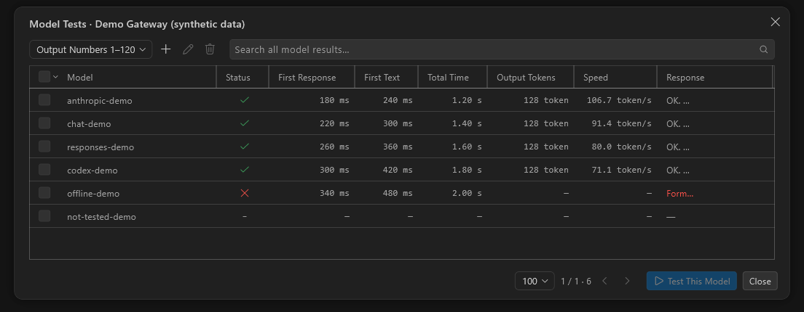
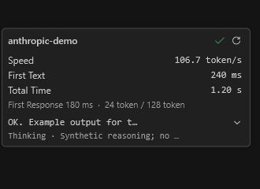
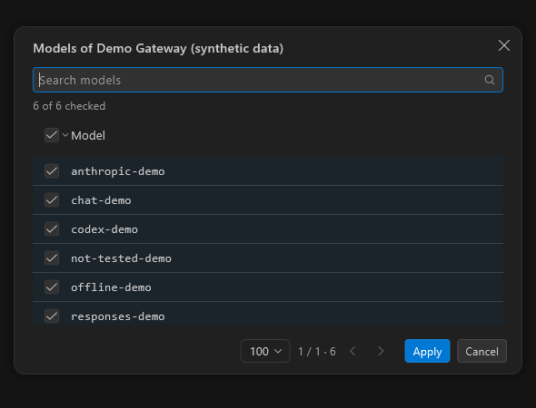
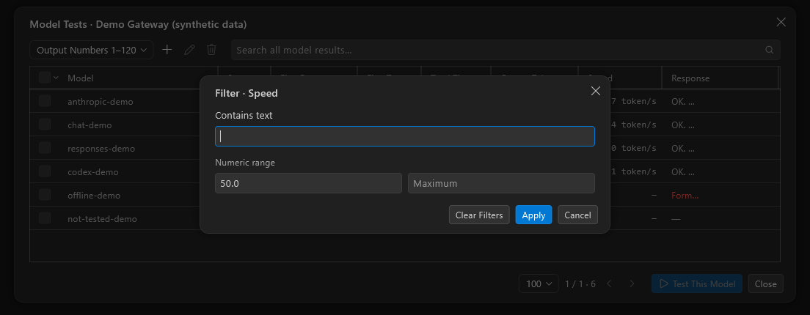

# Model testing workbench

## Problem

The existing provider connection check only lists upstream models. A successful model-list request does not establish that an individual model can produce a complete streamed response, and it provides no first-text latency, throughput, response preview or batch comparison. Large provider lists also need page-scoped selection, sorting, filtering and usable column widths.

## Behavior

- Testing is exposed only for user-configured providers, not the built-in Claude Code setup. Both manually added and discovered models are supported.
- Single-model actions and the batch dialog share a process-session service. Results survive dialog closure and settings navigation, but are not persisted and disappear after the application exits.
- Anthropic Messages, OpenAI Chat Completions, OpenAI Responses and ChatGPT/Codex use their native streaming endpoints and completion events. Codex reuses the existing account refresh and request-preparation code.
- A result passes only after a native completion event and nonempty text. Premature EOF, malformed/error events, unsupported finish reasons, empty text, cancellation and timeout do not produce a green success check.
- The queue is bounded to three concurrent requests, deduplicates active model runs and applies a 45-second timeout. Cancellation closes only that run's HTTP client. Stream notifications are throttled, and retained text/reasoning is capped at 64K characters each.
- First response includes text/reasoning; first text excludes reasoning. Throughput is output tokens divided by total elapsed time. Usage is preferred; otherwise UTF-8 bytes divided by four is explicitly marked with `~` as an estimate. Every numeric cell carries its unit; subsecond times use milliseconds.
- No history, tools or explicit temperature is added. Reasoning is not actively enabled; `effort=none` is sent only when the configured model explicitly advertises it. Some upstream models may still reason by default.

## Interface and persistence

- Successful model actions show a green check and token/s; failed runs show a red cross. Only the first click with no result sends a test request. Later clicks open a stable, compact result panel; only its explicit refresh icon retests, and refresh is disabled while running.
- Table response cells stay short. A roughly 300px-wide result view combines response and subdued reasoning in one selectable text block, initially previewing 24 graphemes per part. A single expand action reveals full retained content. Metrics and text support manual selection/copy without redundant copy icons. Batch hovers stay open over their whole surface and dismiss about 120ms after leaving; clicked single-model panels dismiss only by clicking outside or pressing Escape.
- Batch testing and model selection share quiet 32px rows, light horizontal separators, selection tint and enlarged selection hit areas. Search/clear icons are integrated into the field. Test prompt text is shown only in add/edit dialogs. Click a header to sort; its right-click menu provides filtering and automatic-width reset, avoiding persistent action icons in every column. Numerical sorts use raw values, keep missing measurements last in either direction and use stable model-ID ties.
- Automatic column widths measure headers and all model rows, not just the current page. Extreme model names are capped; users can drag each column boundary and reset automatic widths. The response column does not grow to the full output length.
- Checkbox strokes use the first checkbox state to choose selection/deselection for the entire gesture. Selection-cell whitespace is interactive, and discovered-model rows are full-row selection targets. Revisiting a row does not toggle it back. Edge scrolling supports lazy rows.
- The aligned top-level checkbox selects/deselects all provider models, including other pages and models hidden by search. Its adjacent scope menu offers explicit current-page selection. Testing executes all selected models within the active filtered dataset, not merely the visible page. Pages use 100 rows by default, with 1000, 10000 and unlimited choices, persisted under `models.table.pageSize`.
- Prompt presets and the selected preset are stored under `models.test.presets` and `models.test.selectedPreset` in the existing `User/settings.json`. The two built-ins cannot be edited/deleted. Custom presets support add/edit/delete, prefill from the current prompt and are shared by single/batch testing.
- The built-in number prompt is: `Output the numbers 1 through 120 separated by a single space. No commas, no newlines, no explanation.` Its source is cursor-byok; the UI displays only the prompt choice, not the project name.

## Screenshots

These are native Windows renders of the actual widgets with **synthetic fixture models, output and measurements**. They are illustrative, not real-provider benchmarks. No API key, real account, provider configuration or private output is included.

### Batch table

### Compact click-open result panel with explicit refresh

### Aligned model picker

### Per-column numeric filter

## Verification and release gate

After merging upstream `main` at `d27c9b604aaaa75204956784f4a9b49aa8399881`:

- `dart run tool/test_models.dart`: **407 tests passed**, covering native protocol HTTP/SSE fixtures, Codex account handling, existing proxy translators, presets, persistence, pagination, sorting/filtering/resizing, selection and interactive hovers.
- Targeted static analysis of the model runtime, settings workbench, shared hover/drag components and packaging tools: no issues.
- The previously failing Codex quota-time assertion no longer fails against the merged upstream version; it was not skipped or bypassed.
- Public screenshots were generated from an isolated, memory-only native fixture. Temporary screenshot harnesses were removed.

Both `tool/build_windows.dart` and `tool/build_macos.dart` call the same fail-fast model test gate before building/packaging, including `--skip-build`. The release workflow invokes these scripts, so test failure prevents the corresponding installer from being produced/uploaded. `flutter build` itself does not automatically run these tests; use the packaging scripts for release artifacts.

Only the relevant model/settings test suite was run, not the repository-wide suite. Protocol tests use loopback services and memory credentials; no live paid-provider call is claimed. Windows native rendering was exercised locally. macOS signing/notarisation and hosted CI were not run locally.

## Upstream integration

The feature branch merges the newest upstream rather than replacing it. The shared `IdeActionButton` conflict keeps both upstream `iconWidget` support and the local label/rich-tooltip behavior. Machine-specific dependency mirror changes are not part of the contribution; the original local lockfile changes are preserved in a backup and Git stash.
